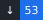
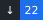

<table width="100%">
<tr>
<td width="72%" valign="middle">

<h1>Regstar</h1>

<strong>Software Engineering student · AI-assisted developer</strong> 
 
Desktop · Android · Networking · Utilities
 

&nbsp;

&nbsp;

&nbsp;

&nbsp;

&nbsp;

&nbsp;

&nbsp;

&nbsp;

&nbsp;

&nbsp;

</td>
<td width="28%" valign="middle" align="center">

</td>
</tr>
</table>

<table width="100%">
<tr>
<td colspan="10" valign="middle">
<h2>Featured projects</h2>
</td>
</tr>

<tr>
<td colspan="5" width="50%" valign="top">

&nbsp;
<a href="https://github.com/Regstar2/dns-switcher"><strong>DnsSwitcher</strong></a>
 
Windows DNS manager with tray UI, diagnostics, failover and Split DNS.  

</td>
<td colspan="5" width="50%" valign="top">

&nbsp;
<a href="https://github.com/Regstar2/white-list-checker"><strong>WhiteListChecker</strong></a>
 
Android network diagnostics with DNS/HTTPS checks, monitoring and notifications.  

</td>
</tr>

<tr>
<td colspan="5" width="50%" valign="top">

&nbsp;
<a href="https://github.com/Regstar2/wdtt-windows-home-gateway"><strong>WDTT Gateway</strong></a>
 
Windows home gateway with Docker, Direct/DNS/WARP modes and diagnostics.  

</td>
<td colspan="5" width="50%" valign="top">

&nbsp;
<a href="https://github.com/Regstar2/tg-ws-proxy-android"><strong>TgWsProxy Android</strong></a>
 
Local Telegram proxy with MTProto/SOCKS5 frontends and configurable routes.  

</td>
</tr>

<tr>
<td colspan="10" valign="top">

<b>☠ Cool skeleton</b>

 

<pre>
                                       ⢀⣤⣶⣿⣿⣿⣿⣿⣿⣶⣤⡀                                      
                                     /111001011010101011\                                    
                                   ⁄100I011010101011100101|                                  
                                  1010101011100101DONT10101                                  
                                _110LIKE101010101110010110101\                               
                                010111001011010RESTRICTIONS101\                              
 /\                             10111H810110101010111001011010=                          0\  
 10                            1100101101010101110010110101010                          101  
  01!\                         _0!11010\|!|!/10101|!|!|1100101                        _11_   
  /1001                        -1 1100       1011       010101                      /1010-   
   1010\                       =01010       101110      01011\                      0111     
    001011\                       0110\  /⁄1\0  =101! ⁄0111/                     -010101     
     /0111001                   10010110101010   11100101101_                  0010110-      
      /10101011                 1010101110010     1101010101                 ⁄0101011\       
       /10010110                  _⁄1\ =00101101010101=                     11001011\        
         =010101011\               =00   101101010101\ 1\                ⁄11001011_          
           0101010111|              101-  -!/101/010  101-             100101101!\           
            /0101011100\|           1011 01/01010111 0010=          |⁄110010110              
              ⁄10101011100\          10⁄1 0  1/1_ 1 -001=         11010101011\               
                  1-001011010!       1010101!0101101101_      01101\_0101\                   
                    01110010110\\|     110010110101010|     ⁄|01010|1110!\                   
                     ⁄0101101010101-      1010111001-     1110010110101                      
                         010111001011010\             011010\1010111                         
                           !001011010101011!\     /1001011010101|\                           
                              ⁄0111001011010101  _01110/0101101                              
                    010101        1100101101010101110010110             _101010-             
                     11100          ⁄1011010_1010=11100101101|          0101\|!              
                      0111\\  |!|!00101=|1010101011\|10010110101\!|!  |01011                 
                      -100101/101010101110010 1101010101110010110101010111\0⁄/\01\ 0110_     
         ⁄1010\110111001011010-⁄10101110=             010110101010\1111NO_SURRENDER\10111    
        00101101NO_MERCY1100101\/10101|                   |!0101110010110\101010111_00101    
        101!/0\/10/\10|\ 11100                                     10110        101010\      
         -1110_           0101101010\                       10111001011                      
                           ⁄|0101010\                       111001011\                       
                               |!|                           |!|0|!\                         
</pre>

</td>
</tr>
</table>
